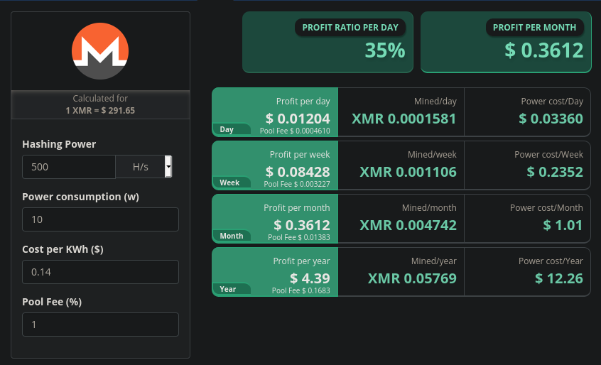

# How to mine cryptocurrencies with android devices

#### Leia em português [aqui](https://github.com/ozzono/articles/blob/master/android-crypto/how-to-mine-pt.md)

## Initial Considerations

With so many aging android devices through out the time but still functional, this tutorial pretend to validade the alternative use for mining crypto currencies.

Apple and Google restricted the installation of crypto mining applications. The argument is that due to high processing demand it would reduce the battery usage life.  
Android users still can find and install apps outside the Play Store with sideloading, but this approach has high risks since its hard to audit the app and guarantee the absence of malicious software.
Thus, this article suggests a differente approach using a Linux emulator available in the Play Store.
This article uses **[UserLand](https://play.google.com/store/apps/details?id=tech.ula)** and **Moto X 2013**.

### Preparing the environment

- Install [UserLand](https://play.google.com/store/apps/details?id=tech.ula) (available for Android 5.0 or higher).
- For this tutorial it was chosen the debian image, but there are alternatives images.
- After downloading and installing the image it is needed to insert user name and passwords.  
  
- And chose the connection type: `ssh`  
  
- Once installed insert the password chosen previously
- Linux configuration finished

After the Linux install, some packages must be installed before installing the miner itself.

- `apt update`
- To ease the configuration it is possible to access the emulated Linux via reverse ssh:
  - `apt install openssh-server -y`
  - `ssh -R \<port\>:localhost:22 \<user\>@\<host\>`
    - the chosen port must be unused in the remote machine
    - once set the reverse connection, it is possible to access from the remote machine: `ssh <android-user>@localhost -p <port>`
    - This tutorial used the port `40000` and named the usar as `android`:
      - from the android device: `ssh -R 40000:localhost:22 ur_user@ur_host_ip`
      - `ssh android@localhost -p 40000`
- `apt upgrade`
- `apt install vim git build-essential cmake libhwloc-dev libssl-dev libuv1-dev`

### Installing the miner

Due to the devices limitations, this tutorial suggests the mining of [Monero](https://www.getmonero.org/), since its still performant without GPU alongside the usage of a mining pool, so below follows the [XMRig](https://www.getmonero.org/resources/user-guides/mine-to-pool.html) installation steps.

- `git clone https://github.com/xmrig/xmrig.git`
  - if `git clone` fails:
    - `apt install wget unzip`
    - `wget https://github.com/xmrig/xmrig/archive/refs/heads/master.zip`
    - `unzip xmrig-master`
    - `mv xmrig-master xmrig`
- `cd xmrig`
- `cmake -Bbuild`
- `make -Cbuild -j$(nproc)` (may take a while)
- `cp src/config.json build/.`
- `cd build`
- edit `config.json` with pools url and wallet' address as in user field
  - choose a _pool_ [here](https://miningpoolstats.stream/monero)
  - create a wallet address [here](https://moneroaddress.org/) or follow [this tutorial](https://www.youtube.com/watch?v=wMY_Sx3o26k&list=WL&index=18&t=46s) to create an even safer wallet address:

    ```json
    {
    // [...]
    "pools": [
    {
      "url": "pool.url.here:3333",//replace 3333 by the pools port
      "user": "wallet_address_here"
    }
    ],
    // [...]
    }
    ```

- `./build/xmrig`
- _Et voilà_. Running a monero mining with XMRig in an Android device.

    ```log
    (this execution used moneroocean pool)
    * ABOUT        XMRig/6.12.2 gcc/8.3.0
    * LIBS         libuv/1.24.1 OpenSSL/1.1.1d hwloc/1.11.12
    * HUGE PAGES   supported
    * 1GB PAGES    unavailable
    * CPU          Qualcomm Krait (1) 32-bit -AES
                    L2:0.0 MB L3:0.0 MB 2C/2T NUMA:1
    * MEMORY       1.4/1.8 GB (83%)
    * DONATE       1%
    * POOL #1      gulf.moneroocean.stream:10128 algo auto
    * COMMANDS     hashrate, pause, resume, results, connection
    * OPENCL       disabled
    * CUDA         disabled
    [2021-06-03 19:18:43.891]  net      use pool gulf.moneroocean.stream:10128  18.210.126.40
    [2021-06-03 19:18:43.898]  net      new job from gulf.moneroocean.stream:10128 diff 128001 algo rx/0 height 2375306
    [2021-06-03 19:18:43.899]  cpu      use argon2 implementation default
    [2021-06-03 19:18:45.109]  randomx  init dataset algo rx/0 (2 threads) seed 85170d70e15e4035...
    [2021-06-03 19:18:45.110]  randomx  not enough memory for RandomX dataset
    [2021-06-03 19:18:45.112]  randomx  failed to allocate RandomX dataset, switching to slow mode (2 ms)
    [2021-06-03 19:19:03.534]  randomx  dataset ready (18421 ms)
    [2021-06-03 19:19:03.536]  cpu      use profile  rx  (2 threads) scratchpad 2048 KB
    [2021-06-03 19:19:03.547]  cpu      READY threads 2/2 (2) huge pages 0% 0/2 memory 4096 KB (11 ms)
    [2021-06-03 19:19:26.656]  net      new job from gulf.moneroocean.stream:10128 diff 128001 algo rx/0 height 2375307
    [2021-06-03 19:20:10.599]  miner    speed 10s/60s/15m 0.42 0.40 n/a H/s max 0.53 H/s
    [2021-06-03 19:21:20.040]  miner    speed 10s/60s/15m 0.42 0.38 n/a H/s max 0.53 H/s
    [2021-06-03 19:22:09.250]  net      new job from gulf.moneroocean.stream:10128 diff 74597 algo rx/0 height 2375307
    [2021-06-03 19:22:20.134]  miner    speed 10s/60s/15m 0.42 0.42 n/a H/s max 0.53 H/s
    [2021-06-03 19:22:34.887]  net      new job from gulf.moneroocean.stream:10128 diff 74597 algo rx/0 height 2375308
    [2021-06-03 19:23:09.264]  net      new job from gulf.moneroocean.stream:10128 diff 33663 algo rx/0 height 2375308
    [2021-06-03 19:23:20.227]  miner    speed 10s/60s/15m 0.42 0.44 n/a H/s max 0.53 H/s
    [2021-06-03 19:23:37.927]  net      new job from gulf.moneroocean.stream:10128 diff 33663 algo rx/0 height 2375309
    [2021-06-03 19:24:09.277]  net      new job from gulf.moneroocean.stream:10128 diff 12394 algo rx/0 height 2375309
    [2021-06-03 19:24:20.337]  miner    speed 10s/60s/15m 0.42 0.44 n/a H/s max 0.53 H/s
    ```

### Conclusion

### Using Linux emulation with slow processing in an old android device to mine cryptos isn't profitable, even if it is pooling monero

It is perfectly possible to mine monero or any other crypto using android. Depending of the device it may even be profitable but deffinetly not with low-processing old ones.

- With UserLand in a Moto X 2013:
  - Hashrate: 0.42H/s
  - Power Consumption: 4.335W
    - For this experiment it was used a usb wall charger with de 5.1V and 850mA output (considering the device uses external energy source while mining)
    - P = V \* I --> P = 5.1 \* 0.850
  - Electric energy is expensive in Brazil. In São Paulo, when this article was written, with direct conversion: **US$ 0.14 KWh**.
  - Result: it's not worth it!  
    

  [image source](https://www.cryptocompare.com/mining/calculator/xmr?HashingPower=0.42&HashingUnit=H%2Fs&PowerConsumption=4.335&CostPerkWh=0.14&MiningPoolFee=1)
  
### Curiosity

This tutorial was also performed in a Oneplus 6T (oneplus 6010) and returned a very curious and distinct result:
> Oneplus' OxygenOS also has an agressive background app killing behaviour that must be taken into account. The miner was kept alive for near 10 minutes.

- Hashrate: 597H/s
- Power Consumption: 20.4W
  - For this experiment it was used a usb wall charger with 5.1V and 4A output (considering the device uses external energy source while mining)
  - P = V \* I --> P = 5.1 \* 4

But its still not worth it  
    
  [image source](https://www.cryptocompare.com/mining/calculator/xmr?HashingPower=597&HashingUnit=H%2Fs&PowerConsumption=20&CostPerkWh=1&MiningPoolFee=1)

### References

- [XMRig on Raspberrypi OS 32-bit](https://www.raspberrypi.org/forums/viewtopic.php?f=63&t=305983&sid=99d0bfda8541024dda55613f7e3a942f)
- [How to mine on a pool with XMRig](https://www.getmonero.org/resources/user-guides/mine-to-pool.html)
- [Mining Calculator](https://www.cryptocompare.com/mining/calculator/xmr?HashingPower=170&HashingUnit=H%2Fs&PowerConsumption=4.335&CostPerkWh=0.14&MiningPoolFee=1)
