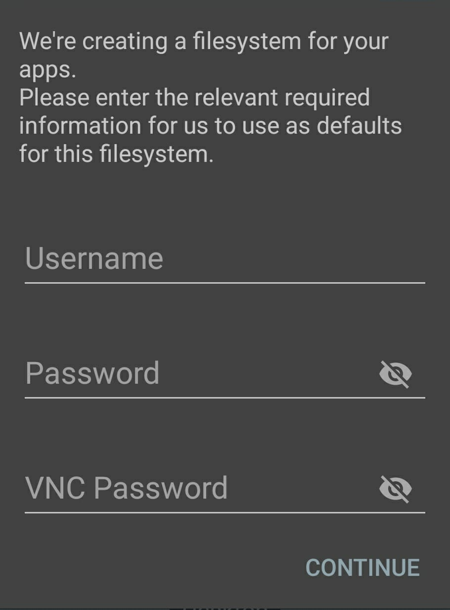
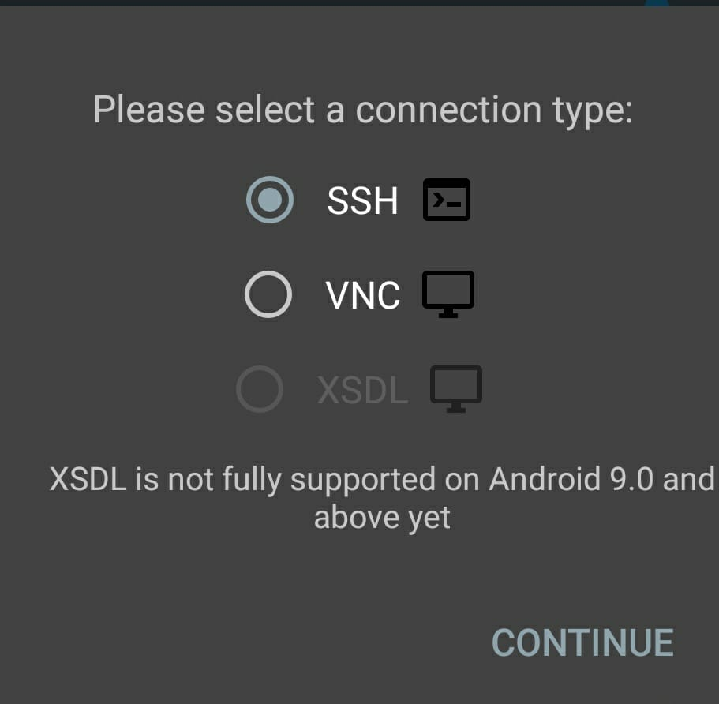
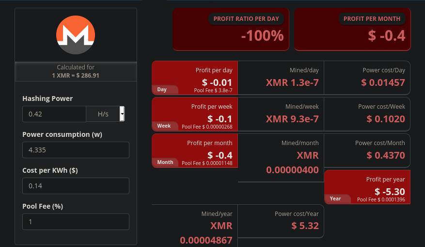

# Como minerar criptomoeda com dispositivo Android

#### Read this article in english [here](https://github.com/ozzono/articles/blob/master/android-crypto/how-to-mine-en.md)

## Considerações iniciais

Com tantos dispositivos android tornados obsoletos ao longo do tempo mas ainda funcionais, esse tutorial pretende validar o uso alternativo para mineração de criptomoedas.

Tanto Apple quanto Google restringiram a instalação de aplicativos para mineração de criptomoedas. O argumento usado é que por demandar alto desempenho acabe por prejudicar a durabilidade da bateria do dispositivo.  
Sendo assim, os usuários de Android ainda têm a opção de fazer a instalação de um app por fora da loja; o chamado _sideload_. Essa abordagem tem enorme risco em razão do aplicativo escolhido ser difícil de auditar e de garantir a ausência de software malicioso.
Em razão do exposto, esse artigo propõe uma abordagem diferente, usando um emulador de Linux disponível na Play Store.  
Nesse artigo será usado o **[UserLand](https://play.google.com/store/apps/details?id=tech.ula)** e um **Moto X 2013**.

### Configurando o ambiente

- Instale o [UserLand](https://play.google.com/store/apps/details?id=tech.ula) (disponível apenas para Android 5.0 ou superior).
- Para esse tutorial a imagem escolhida foi do Debian, mas há liberdade para usar outra imagem.
- Após baixar e instalar a imagem, é preciso inserir usuário e senhas da nova máquina Linux.
    <div style="text-align:left">
        
    </div>
- E escolher o tipo de conexão a ser utilizado: `ssh`
    <div style="text-align:left">
        
    </div>
- Após o download e instalação, será pedida a senha inserida anteriormente
- Configuração do Linux concluída.

Após a instalação inicial, é preciso instalar alguns pacotes antes da instalação do minerador.

- `apt update`
- Para facilitar a utilização e evitar a digitação de comandos direto no dispositivo, é possível acessar remotamente utilizando ssh reverso:
  - `apt install openssh-server -y`
  - `ssh -R \<port\>:localhost:22 \<user\>@\<host\>`
    - a porta em questão deve estar ociosa na máquina a partir da qual se pretende acessar
    - uma vez feita a conexão reversa com a máquina remota, deve-se acessar a partir desta: `ssh <android-user>@localhost -p <port>`
    - Esse tutorial utilizou a porta `40000` e chamou o usuário de `android`, portanto:
      - no android: `ssh -R 40000:localhost:22 ur_user@ur_host_ip`
      - `ssh android@localhost -p 40000`
- `apt upgrade`
- `apt install vim git build-essential cmake libhwloc-dev libssl-dev libuv1-dev`

### Instalando o minerador

Em razão das limitações impostas pelo dispositivo proposto, esse tutorial sugere minerar [Monero](https://www.getmonero.org/), por se tratar de criptomoeda que desempenha bem sem GPU, além de sugerir também a mineração junto a algum _pool_, portanto seguirá os passos para instalação do [XMRig](https://www.getmonero.org/resources/user-guides/mine-to-pool.html).

- `git clone https://github.com/xmrig/xmrig.git`
  - se esse passo falhar:
    - `apt install wget unzip`
    - `unzip xmrig-master`
    - `mv xmrig-master xmrig`
- `cd xmrig`
- `cmake -Bbuild`
- `make -Cbuild -j$(nproc)` (pode demorar um pouco)
- `cp src/config.json build/.`
- edite o `config.json` com a url do _pool_ e do _wallet_address_
    - escolha um _pool_ [aqui](https://miningpoolstats.stream/monero)
    - crie endereço um [aqui](https://moneroaddress.org/) ou com garantia de segurança seguindo [esse tutorial](https://www.youtube.com/watch?v=wMY_Sx3o26k&list=WL&index=18&t=46s):

    ```json
    {
    // [...]
    "pools": [
    {
        "url": "pool.url.here:3333",//substitua 3333 pela porta utilizada pelo pool
        "user": "wallet_address_here"
    }
    ],
    // [...]
    }
    ```

- `./build/xmrig`
- _Et voilà_. Minerador de Monero rodando com pool usando o XMRig.

    ```log
    (this execution used moneroocean pool)
    * ABOUT        XMRig/6.12.2 gcc/8.3.0
    * LIBS         libuv/1.24.1 OpenSSL/1.1.1d hwloc/1.11.12
    * HUGE PAGES   supported
    * 1GB PAGES    unavailable
    * CPU          Qualcomm Krait (1) 32-bit -AES
                    L2:0.0 MB L3:0.0 MB 2C/2T NUMA:1
    * MEMORY       1.4/1.8 GB (83%)
    * DONATE       1%
    * POOL #1      gulf.moneroocean.stream:10128 algo auto
    * COMMANDS     hashrate, pause, resume, results, connection
    * OPENCL       disabled
    * CUDA         disabled
    [2021-06-03 19:18:43.891]  net      use pool gulf.moneroocean.stream:10128  18.210.126.40
    [2021-06-03 19:18:43.898]  net      new job from gulf.moneroocean.stream:10128 diff 128001 algo rx/0 height 2375306
    [2021-06-03 19:18:43.899]  cpu      use argon2 implementation default
    [2021-06-03 19:18:45.109]  randomx  init dataset algo rx/0 (2 threads) seed 85170d70e15e4035...
    [2021-06-03 19:18:45.110]  randomx  not enough memory for RandomX dataset
    [2021-06-03 19:18:45.112]  randomx  failed to allocate RandomX dataset, switching to slow mode (2 ms)
    [2021-06-03 19:19:03.534]  randomx  dataset ready (18421 ms)
    [2021-06-03 19:19:03.536]  cpu      use profile  rx  (2 threads) scratchpad 2048 KB
    [2021-06-03 19:19:03.547]  cpu      READY threads 2/2 (2) huge pages 0% 0/2 memory 4096 KB (11 ms)
    [2021-06-03 19:19:26.656]  net      new job from gulf.moneroocean.stream:10128 diff 128001 algo rx/0 height 2375307
    [2021-06-03 19:20:10.599]  miner    speed 10s/60s/15m 0.42 0.40 n/a H/s max 0.53 H/s
    [2021-06-03 19:21:20.040]  miner    speed 10s/60s/15m 0.42 0.38 n/a H/s max 0.53 H/s
    [2021-06-03 19:22:09.250]  net      new job from gulf.moneroocean.stream:10128 diff 74597 algo rx/0 height 2375307
    [2021-06-03 19:22:20.134]  miner    speed 10s/60s/15m 0.42 0.42 n/a H/s max 0.53 H/s
    [2021-06-03 19:22:34.887]  net      new job from gulf.moneroocean.stream:10128 diff 74597 algo rx/0 height 2375308
    [2021-06-03 19:23:09.264]  net      new job from gulf.moneroocean.stream:10128 diff 33663 algo rx/0 height 2375308
    [2021-06-03 19:23:20.227]  miner    speed 10s/60s/15m 0.42 0.44 n/a H/s max 0.53 H/s
    [2021-06-03 19:23:37.927]  net      new job from gulf.moneroocean.stream:10128 diff 33663 algo rx/0 height 2375309
    [2021-06-03 19:24:09.277]  net      new job from gulf.moneroocean.stream:10128 diff 12394 algo rx/0 height 2375309
    [2021-06-03 19:24:20.337]  miner    speed 10s/60s/15m 0.42 0.44 n/a H/s max 0.53 H/s
    ```

### Conclusão

### Utilizando um dispositivo tão limitado e com emulação do Linux não é vantajoso minerar criptomoedas, mesmo que seja monero e utilizando um pool!

Atualmente é perfeitamente possível minerar monero ou qualquer outra criptomoeda utilizando um dispositivo android. A depender do aparelho cabe discutir se é viável ou vantajoso.

- Utilizando essa configuração com UserLand num Moto X 2013:
  - Taxa de conversão: 0.42H/s
  - Consumo: 4.335W
    - Para esse experimento foi usado um carregador usb de 5.1V e 850mA
    - P = V *I --> P = 5.1* 0.850
  - No Brasil a energia elétrica custa caro. Durante a escrita desse artigo, em São Paulo e com conversão direta: **US$ 0.14 KWh**.
  - Resultado: não vale a pena
    <div style="text-align:center">
        
        <br/>
        <a href="https://www.cryptocompare.com/mining/calculator/xmr?HashingPower=0.42&HashingUnit=H%2Fs&PowerConsumption=4.335&CostPerkWh=0.14&MiningPoolFee=1">origem da imagem</a>
    </div>

### Referências
- [Xmrig on Raspberrypi OS 32-bit](https://www.raspberrypi.org/forums/viewtopic.php?f=63&t=305983&sid=99d0bfda8541024dda55613f7e3a942f)
- [How to mine on a pool with XMRig](https://www.getmonero.org/resources/user-guides/mine-to-pool.html)
- [Mining Calculator](https://www.cryptocompare.com/mining/calculator/xmr?HashingPower=170&HashingUnit=H%2Fs&PowerConsumption=4.335&CostPerkWh=0.14&MiningPoolFee=1)

> Revisado por Carolina Brandão
